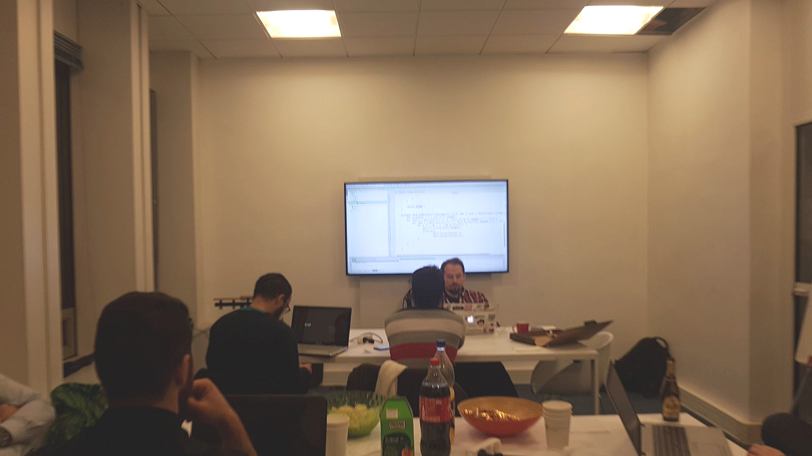
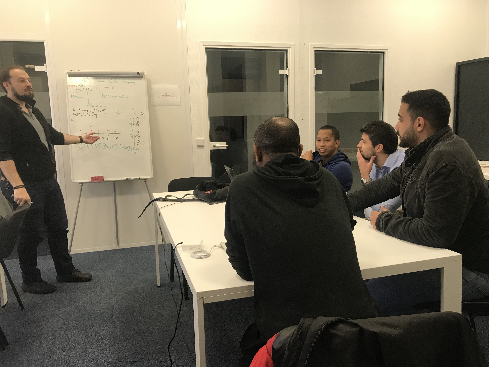

Le Meetup
============

Dev4FunParis est un [meetup](https://www.meetup.com/fr-FR/Dev4Fun-Paris/) mensuel qui chercher à rassembler les développeurs dans une ambiance conviviale. Le but est d'apprendre et d'échanger sur nos méthodes de développement tout en s'amusant. 

Nous utilisons souvent la plateforme Codingame pour animer nos soirées :-) !

Date du prochain meetup : `le 21 Février`

[2018-01-17] Dev4Fun #29
----------------------

Le Dev4fun 29 à eu lieu chez [Adneom](https://www.adneom.com/fr)

<p align="center"></p>

### Programme de la soirée :

#### Pertes en bourse
Les marchands de codingame blâment les dieux du chaos qui manipulerai leur pertes en bourse, venez enquêter. [énoncé](https://www.codingame.com/training/medium/stock-exchange-losses)

notre solution en java : 

```java
import org.junit.Assert;
import org.junit.Test;

import java.util.ArrayList;
import java.util.Arrays;
import java.util.List;

public class LosesTest {

    @Test
    public void closeCompareTest() {
        Assert.assertArrayEquals(new int[]{-1, -3}, closeCompare(new int[]{3, 2, 4, 2, 1, 5}));
    }

    @Test
    public void maxLosesTest() {
        Assert.assertEquals(-3, maxLoses(new int[]{-1, -3}));
    }

    @Test
    public void acceptanceTest() {
        Assert.assertEquals(-3, computeMaxLoses(new int[]{3, 2, 4, 2, 1, 5}));
        Assert.assertEquals(0, computeMaxLoses(new int[]{1,2,4,4,5}));
        Assert.assertEquals(-4, computeMaxLoses(new int[]{5, 3, 4, 2, 3, 1}));
    }

    private int computeMaxLoses(int[] ints) {
        return maxLoses(closeCompare(ints));
    }

    private int maxLoses(int[] ints) {
        int maxLoses = 0;
        for (int loses : ints) {
            maxLoses = Math.min(maxLoses,loses);
        }
        return maxLoses;
    }

    private int[] closeCompare(int[] ints) {
        List<Integer> indexes= new ArrayList<>();
        indexes.add(0);
        int indexCurrentMax = 0;
        for (int i = 1; i < ints.length - 2; i++) {
            if(ints[i] > ints[indexCurrentMax]) {
                indexCurrentMax = i;
                indexes.add(i);
            }
        }
        indexes.add(ints.length-1);
        int[] result = new int[indexes.size()-1];
        for (int i = 0; i < indexes.size()-1 ; i++) {
            int min = ints[indexes.get(i)];
            for (int j = indexes.get(i); j <= indexes.get(i+1) ; j++) {
                min = Math.min(min,ints[j]);
            }
            result[i]= min - ints[indexes.get(i)];
        }
        return result;
    }
}
```

#### Cases connectées
En creusant dans les tunnels d’hackerrank les alchimistes on découverts de curieux mécanismes qui fonctionnent avec des tablettes, ils n’arrivent pas à les remettre en route et cherche des ingénieurs. [énoncé](https://www.hackerrank.com/challenges/connected-cell-in-a-grid/problem)

notre début solution en java : 

```java
import org.junit.Assert;
import org.junit.Test;

import java.util.*;

public class GridTest {

    @Test
    public void computeLinksTest() {
        Map<Integer,Set<Integer>> expectedLinks = new HashMap<>();
        expectedLinks.put(0, Collections.singleton(3));
        Assert.assertEquals(expectedLinks,
                computeLinks(new boolean[][]{
                        new boolean[]{true,false},
                        new boolean[]{false,true},
                })
        );
    }

    @Test
    public void mergeSetsTest() {
        Map<Integer,Set<Integer>> links = new HashMap<>();
        links.put(0,Set.of(1,5));
        links.put(1,Set.of(5,6));
        links.put(5,Set.of(6,10));
        links.put(6,Set.of(10));
        links.put(10,Set.of(11));
        Assert.assertEquals(6,groupMax(links));

    }

    private int groupMax(Map<Integer, Set<Integer>> links) {
        Iterator<Integer> keys = links.keySet().iterator();
        while (keys.hasNext()){
            List<Integer> elements = new ArrayList<>();
            Integer key = keys.next();
            elements.addAll(links.get(key));
            r(links,elements,0);

        }
        return 0;
    }

    private void r(Map<Integer,Set<Integer>> links, List<Integer> elements,int index){
        List<Integer> toAdd = new ArrayList<>();
        for (int k  = index; k < elements.size(); k++) {
            toAdd.addAll(links.get(elements.get(index)));
            //
        }

        if(!elements.containsAll(toAdd)) {
            elements.addAll(toAdd);
            r(links, elements, index + toAdd.size());
        }
    }


    @Test
    public void computeLinksTest2() {
        Map<Integer,Set<Integer>> expectedLinks = new HashMap<>();
        expectedLinks.put(0,Set.of(1,5));
        expectedLinks.put(1,Set.of(5,6));
        expectedLinks.put(5,Set.of(6,10));
        expectedLinks.put(6,Set.of(10));
        expectedLinks.put(10,Set.of(11));
        boolean[][] grid = new boolean[][]{
                new boolean[]{true,true,false,false},
                new boolean[]{false,true,true,false},
                new boolean[]{false,false,true,false},
                new boolean[]{true,false,false,true},
        };

        for (boolean[] line :
                grid) {
            System.out.println(Arrays.toString(line));
        }

        System.out.println(grid[0][1]);

        Assert.assertEquals(expectedLinks,
                computeLinks(grid)
        );
    }

    private Map<Integer, Set<Integer>> computeLinks(boolean[][] grid) {
        Map<Integer,Set<Integer>> links = new HashMap<>();

        for (int i = 0; i < grid.length; i++) {
            for (int j = 0; j < grid[i].length; j++) {
                if(grid[i][j]) {
                    addNeighbors(grid,i,j,links);
                }
            }
        }

        return links ;
    }

    private void addNeighbors(boolean[][] grid, int i, int j, Map<Integer, Set<Integer>> links) {
        int gridIndex = j + i*grid[i].length;
        Set<Integer> neighbors = new HashSet<>();
        for (int k = Math.max(i-1,0); k <= Math.min(grid.length-1,i+1) ; k++) {
            for (int l = Math.max(j-1,0); l <= Math.min(grid[k].length-1,j+1) ; l++) {
                System.out.println(String.format("%d,%d %b",k,l,grid[k][l]));
                if( !(k == i && l == j) && grid[k][l]) {
                    int n = l+(k*grid[k].length);
                    if(n > gridIndex)
                        neighbors.add(n);
                }
            }
        }
        if(!neighbors.isEmpty()) {
            links.put(gridIndex, neighbors);
        }
    }

}
```

[2017-12-13] Dev4Fun #28
------------------------

Le Dev4fun 28 à eu lieu chez [Adneom](https://www.adneom.com/fr)

<p align="center">   </p>


### Programme de la soirée : 

#### Suite de Conway
Sorciers du code, choisissez votre langage et vos compagnons pour affronter la « SUITE DE CONWAY » sur les terres de Codingame.
[énoncé](https://www.codingame.com/training/medium/conway-sequence)

notre solution en groovy : 

```groovy
input = new Scanner(System.in);

r = input.nextInt()
l = input.nextInt()

c = [[r],[1,r]]
(2..l-1).each {
    List list = c[it - 1]
    result = []
    i = 1
    while (i <= list.size()) {
        count = 1
        while (list[i - 1] == list[i]) {
            count++
            i++
        }
        result.add(count)
        result.add(list[i - 1])
        count = 1
        i++
    }
    c.add(result)
}
println(c[l-1].join(" "))
```

#### Hackerland radio transmitters
Dans les tunnels d’Hackerrank, la cité Hackerland à besoin d’ingénieurs pour rétablir leur système de communication.
[énoncé](https://www.hackerrank.com/challenges/hackerland-radio-transmitters/problem)

notre solution en groovy : 

```groovy
s= new Scanner(System.in);
int n = s.nextInt();
int portee = s.nextInt();
maisons=new TreeSet<>()
for(int x_i=0; x_i < n; x_i++){
    maisons.add(s.nextInt())
}

min = maisons.min()
max = maisons.max()
transmiters=[]
for(i = min; i <= max; i++) {
    if (maisons.contains(i)) {
        k = i + portee
        while (!maisons.contains(k)) {
            k--
        }
        transmiters.add(k)
        i = k + portee
    }
}

println(transmiters.size())
```
