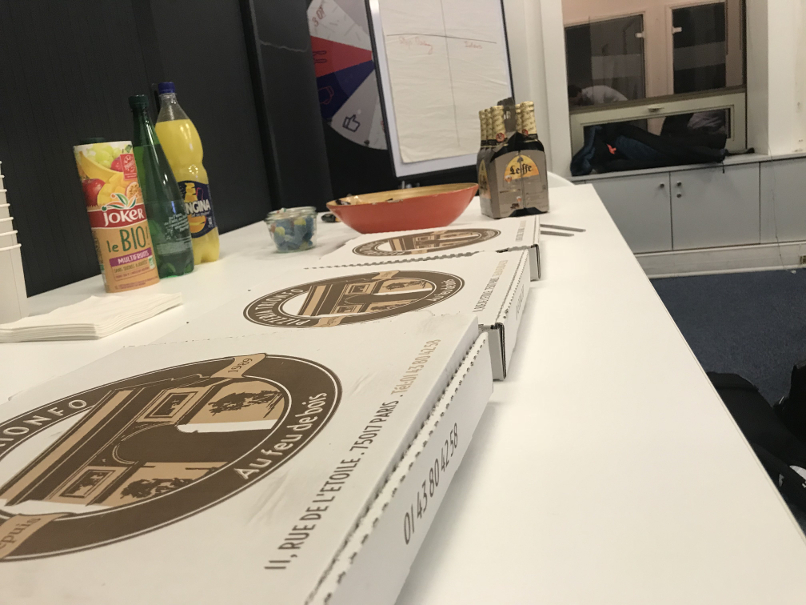

Le Meetup
============

Dev4FunParis est un [meetup](https://www.meetup.com/fr-FR/Dev4Fun-Paris/) mensuel qui chercher à rassembler les développeurs dans une ambiance conviviale. Le but est d'apprendre et d'échanger sur nos méthodes de développement tout en s'amusant. 

Nous utilisons souvent la plateforme [Codingame](https://www.codingame.com) pour animer nos soirées :-) !

Date du prochain meetup : `mi-Janvier`

[2017-12-13] Dev4Fun #28
------------------------

Le Dev4fun 28 à eu lieu chez [Adneom](https://www.adneom.com/fr)

<p align="center">   </p>


### Programme de la soirée : 

#### Suite de Conway
Sorciers du code, choisissez votre langage et vos compagnons pour affronter la « SUITE DE CONWAY » sur les terres de Codingame.
[énoncé](https://www.codingame.com/training/medium/conway-sequence)

notre solution en groovy : 

```groovy
input = new Scanner(System.in);

r = input.nextInt()
l = input.nextInt()

c = [[r],[1,r]]
(2..l-1).each {
    List list = c[it - 1]
    result = []
    i = 1
    while (i <= list.size()) {
        count = 1
        while (list[i - 1] == list[i]) {
            count++
            i++
        }
        result.add(count)
        result.add(list[i - 1])
        count = 1
        i++
    }
    c.add(result)
}
println(c[l-1].join(" "))
```

#### Hackerland radio transmitters
Dans les tunnels d’Hackerrank, la cité Hackerland à besoin d’ingénieurs pour rétablir leur système de communication.
[énoncé](https://www.hackerrank.com/challenges/hackerland-radio-transmitters/problem)

notre solution en groovy : 

```groovy
s= new Scanner(System.in);
int n = s.nextInt();
int portee = s.nextInt();
maisons=new TreeSet<>()
for(int x_i=0; x_i < n; x_i++){
    maisons.add(s.nextInt())
}

min = maisons.min()
max = maisons.max()
transmiters=[]
for(i = min; i <= max; i++) {
    if (maisons.contains(i)) {
        k = i + portee
        while (!maisons.contains(k)) {
            k--
        }
        transmiters.add(k)
        i = k + portee
    }
}

println(transmiters.size())
```
